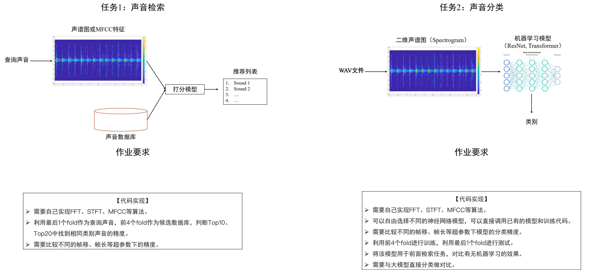

# DSP-HW

**Jiajun Liu, Haoxiang Sun, Yuan Tian, Xuyan Ye, Zijie Lin**

## Intro

This is the repository of the final project of the course DSP taught by Prof. Wenbing Huang.

## Inital Structure

```
DSP_Final_Project/
├── ESC-50
├── README.md               # 项目介绍、运行指南、成员分工
├── requirements.txt        # 依赖库
├── data/                   # 数据存放 (不要上传到git，只放占位符)
│   ├── raw/                # 原始WAV文件
│   └── processed/          # 提取好的特征 (npy文件)
├── src/                    # 源代码
│   ├── dsp_core/           # 【核心】手写DSP算法模块
│   │   ├── __init__.py
│   │   ├── fft.py          # 手写FFT实现
│   │   ├── stft.py         # 手写STFT实现
│   │   └── mfcc.py         # 手写MFCC实现
│   ├── models/             # 神经网络模型
│   │   ├── resnet.py
│   │   └── transformer.py
│   ├── utils/              # 工具函数
│   │   ├── dataset.py      # PyTorch Dataset/Dataloader
│   │   ├── metrics.py      # 计算 Top-K Accuracy, Precision 等
│   │   └── plot.py         # 绘图脚本
│   └── train.py            # 训练脚本
├── experiments/            # 实验记录 (Jupyter Notebooks)
│   ├── 01_dsp_verification.ipynb  # 验证手写算法与标准库的误差
│   ├── 02_task1_retrieval.ipynb   # 任务1：检索实验与超参数分析
│   ├── 03_task2_classification.ipynb # 任务2：分类训练可视化
│   └── 04_large_model_compare.ipynb  # 大模型对比实验
├── scripts/                # 一键运行脚本 (run_task1.sh, run_task2.sh)
└── report/                 # 最终报告与图表资源
```

## Task-description



> ## Requirements
> 
> 任务1：声音检索
> 
> 【代码实现】
> 需要自己实现FFT、STFT、MFCC等算法。
> 利用最后1个fold作为查询声音，前4个fold作为候选数据库，判断Top10、Top20中找到相同类别声音的精度。
> 需要比较不同的帧移、帧长等超参数下的精度。
> 
> 任务2：声音分类
> 
> 【代码实现】
> 需要自己实现FFT、STFT、MFCC等算法。
> 可以自由选择不同的神经网络模型，可以直接调用已有的模型和训练代码。
> 需要比较不同的帧移、帧长等超参数下模型的分类精度。
> 利用前4个fold进行训练，利用最后1个fold进行测试。
> 将该模型用于前面检索任务，对比有无机器学习的效果。
> 需要与大模型直接分类做对比。
> 
> 
> 【提交内容】
> 建议使用Pytorch。
> 报告1份：实现的流程、训练曲线、测试精度、不同setting的比较等。
> 代码1份：包括readme、requirement。
> 
> 分数：50分
> 时间：16周上课前一天提交所有材料，16周进行项目展示
> 组队要求：3~5人，报告需要明确每个人的角色和职责
> 