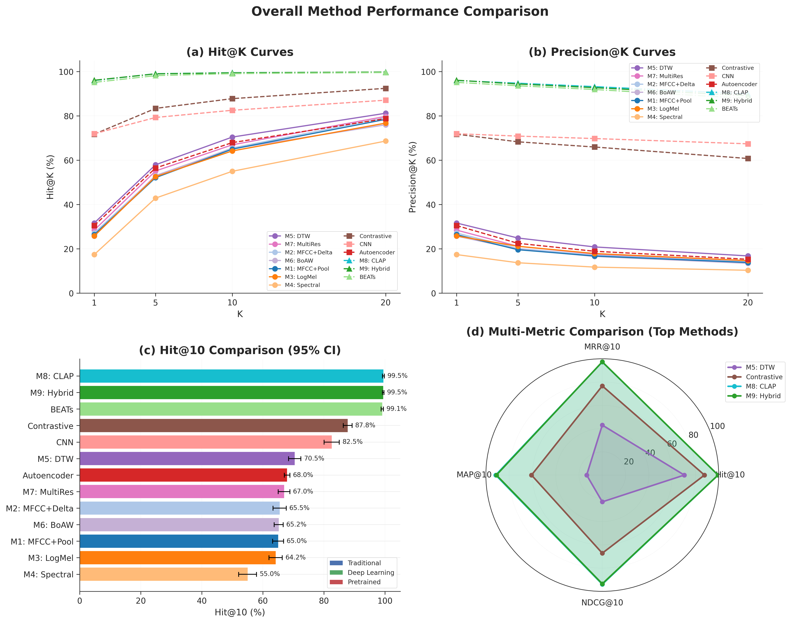
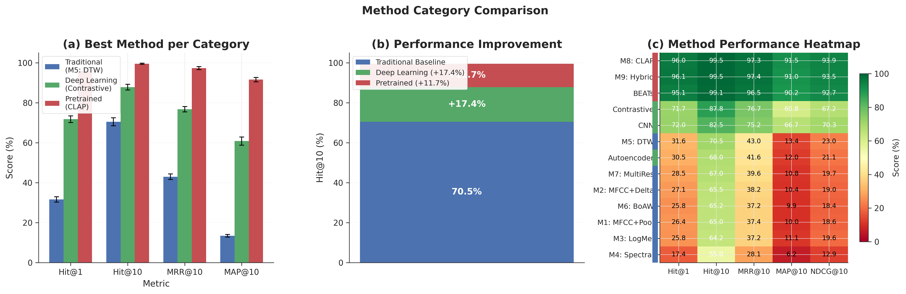
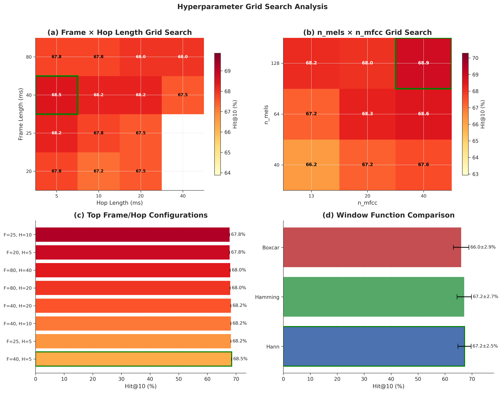
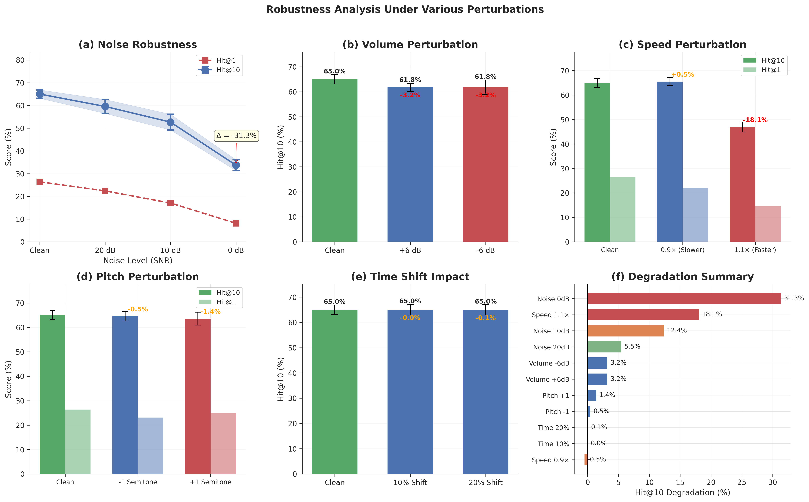
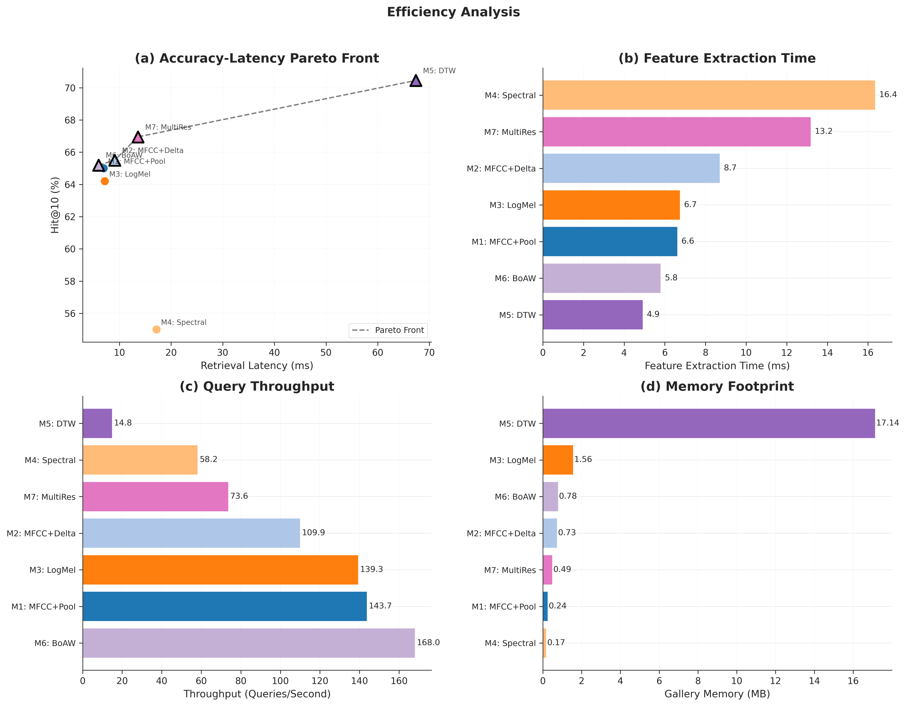
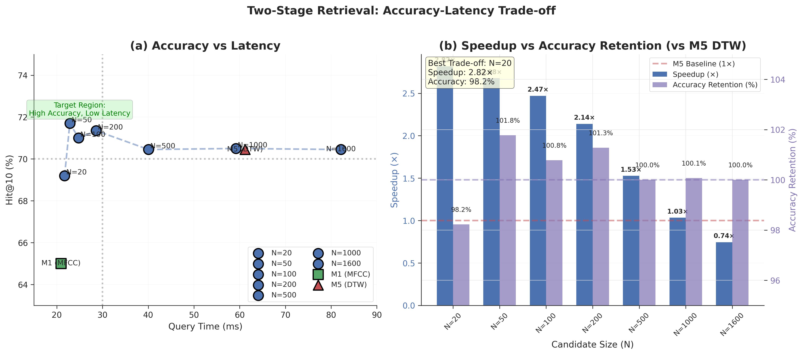
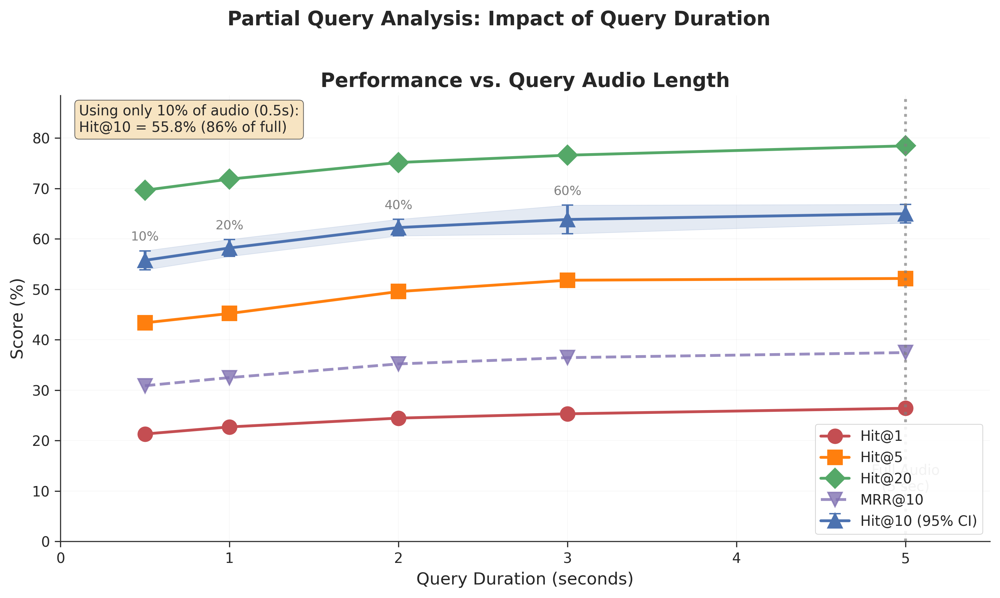
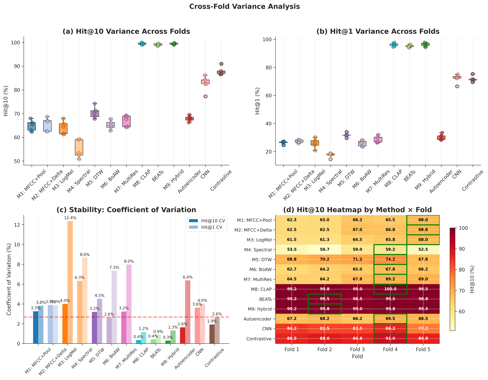

# Audio Retrieval Report (ESC-50)

Generated: 2025-12-19 15:45:19

## 1. Data Sources

- Baseline: `experiments/retrieval/results/20251218_032425/results.json`
- Deep retrievers: `experiments/retrieval/results/deep_retrievers/20251219_152915/results.json`
- Pretrained: `experiments/retrieval/results/pretrained/20251218_125713/results.json`
- Grid search: `experiments/retrieval/results/grid_search/20251218_041636/step1_frame_hop.json`
- Ablations: `experiments/retrieval/results/ablations/20251218_043710/all_ablations.json`
- Robustness: `experiments/retrieval/results/robustness/20251218_044934/all_robustness.json`
- Efficiency: `experiments/retrieval/results/efficiency/20251218_172315/timing.json`
- Fusion: `experiments/retrieval/results/fusion/20251218_051444/all_fusion.json`
- Two-stage: `experiments/retrieval/results/twostage/20251218_172303/n_sweep.json`
- Partial query: `experiments/retrieval/results/partial/20251218_144255/partial_query.json`

## 2. Figures

Figures are generated under `visualization/outputs/` via `python3 visualization/generate_all.py`.

## 3. Overall Performance

| Method | Category | Hit@1 (%) | Hit@5 (%) | Hit@10 (%) | Hit@20 (%) | P@10 (%) | MRR@10 | MAP@10 | NDCG@10 | Hit@10 CI (±pp) |
|---|---|---|---|---|---|---|---|---|---|---|
| `M5_MFCC_DTW` (M5: DTW) | traditional | 31.65 | 57.95 | 70.45 | 81.20 | 20.86 | 0.430 | 0.134 | 0.230 | 2.00 |
| `M7_MultiRes_Fusion` (M7: MultiRes) | traditional | 28.45 | 55.15 | 66.95 | 79.80 | 17.65 | 0.396 | 0.108 | 0.197 | 1.90 |
| `M2_MFCC_Delta_Pool` (M2: MFCC+Delta) | traditional | 27.15 | 52.75 | 65.50 | 79.20 | 17.12 | 0.382 | 0.104 | 0.190 | 2.15 |
| `M6_BoAW_ChiSq` (M6: BoAW) | traditional | 25.75 | 53.10 | 65.20 | 76.00 | 16.57 | 0.372 | 0.099 | 0.184 | 1.47 |
| `M1_MFCC_Pool_Cos` (M1: MFCC+Pool) | traditional | 26.40 | 52.15 | 65.00 | 78.45 | 16.75 | 0.374 | 0.100 | 0.186 | 1.80 |
| `M3_LogMel_Pool` (M3: LogMel) | traditional | 25.80 | 52.60 | 64.20 | 76.75 | 17.88 | 0.372 | 0.111 | 0.196 | 2.17 |
| `M4_Spectral_Stat` (M4: Spectral) | traditional | 17.40 | 42.90 | 55.00 | 68.65 | 11.74 | 0.281 | 0.062 | 0.129 | 2.93 |
| `Deep_Contrastive` (Contrastive) | deep | 71.75 | 83.40 | 87.80 | 92.45 | 65.96 | 0.767 | 0.608 | 0.672 | 1.42 |
| `Deep_CNN` (CNN) | deep | 71.95 | 79.30 | 82.55 | 87.10 | 69.78 | 0.752 | 0.667 | 0.703 | 2.50 |
| `Deep_Autoencoder` (Autoencoder) | deep | 30.50 | 56.50 | 67.95 | 78.80 | 18.90 | 0.416 | 0.120 | 0.211 | 0.90 |
| `M8_CLAP` (M8: CLAP) | pretrained | 96.00 | 99.05 | 99.50 | 99.75 | 93.22 | 0.973 | 0.915 | 0.939 | 0.30 |
| `M9_Hybrid` (M9: Hybrid) | pretrained | 96.10 | 99.00 | 99.45 | 99.80 | 92.75 | 0.974 | 0.910 | 0.935 | 0.25 |
| `BEATs` | pretrained | 95.15 | 98.20 | 99.10 | 99.60 | 91.94 | 0.965 | 0.902 | 0.927 | 0.38 |

_Hit@10 CI (±pp) uses the stored 95% bootstrap CI when available; otherwise it is approximated as 1.96·std/√5 from fold-to-fold std._

## 4. Category Summary

| Category | Best (Hit@10) | Hit@1 (%) | Hit@10 (%) | Hit@10 CI (±pp) |
|---|---|---|---|---|
| traditional | `M5_MFCC_DTW` (M5: DTW) | 31.65 | 70.45 | 2.00 |
| deep | `Deep_Contrastive` (Contrastive) | 71.75 | 87.80 | 1.42 |
| pretrained | `M8_CLAP` (M8: CLAP) | 96.00 | 99.50 | 0.30 |

## 5. Hyperparameter Grid Search

### 5.1 Frame/Hop Length Search

| Rank | Frame (ms) | Hop (ms) | n_fft | hop_length | Hit@10 (%) |
|---|---|---|---|---|---|
| 1 | 40 | 5 | 882 | 110 | 68.50 |
| 2 | 25 | 5 | 551 | 110 | 68.25 |
| 3 | 40 | 10 | 882 | 220 | 68.25 |
| 4 | 40 | 20 | 882 | 441 | 68.25 |
| 5 | 80 | 20 | 1764 | 441 | 68.00 |
| 6 | 80 | 40 | 1764 | 882 | 68.00 |
| 7 | 20 | 5 | 441 | 110 | 67.75 |
| 8 | 25 | 10 | 551 | 220 | 67.75 |
| 9 | 80 | 5 | 1764 | 110 | 67.75 |
| 10 | 80 | 10 | 1764 | 220 | 67.75 |

### 5.2 MFCC Parameters Search

| Rank | n_mels | n_mfcc | Frame (ms) | Hop (ms) | Hit@1 (%) | Hit@10 (%) |
|---|---|---|---|---|---|---|
| 1 | 128 | 40 | 40 | 5 | 25.75 | 69.50 |
| 2 | 64 | 40 | 40 | 5 | 25.50 | 69.25 |
| 3 | 64 | 40 | 40 | 10 | 25.25 | 69.25 |
| 4 | 128 | 40 | 40 | 10 | 25.75 | 69.00 |
| 5 | 128 | 13 | 40 | 5 | 23.50 | 68.75 |
| 6 | 64 | 20 | 40 | 5 | 24.75 | 68.50 |
| 7 | 128 | 13 | 40 | 10 | 23.00 | 68.50 |
| 8 | 64 | 20 | 25 | 5 | 23.75 | 68.25 |
| 9 | 128 | 20 | 25 | 5 | 26.75 | 68.25 |
| 10 | 128 | 40 | 25 | 5 | 26.25 | 68.25 |

### 5.3 Window Function Comparison

| Window | Hit@1 (%) | Hit@10 (%) | Std (%) | MRR@10 |
|---|---|---|---|---|
| Hann | 27.40 | 67.25 | 3.14 | 0.393 |
| Hamming | 27.55 | 67.15 | 3.44 | 0.391 |
| Boxcar | 28.00 | 66.00 | 3.67 | 0.387 |

## 6. Ablation Studies

### Pre-emphasis
| Config | Hit@1 (%) | Hit@10 (%) | Δ Hit@1 (pp) | Δ Hit@10 (pp) |
|---|---|---|---|---|
| no_preemph | 26.40 | 65.00 | +0.00 | +0.00 |
| preemph_0.97 | 27.65 | 63.65 | +1.25 | -1.35 |

### CMVN
| Config | Hit@1 (%) | Hit@10 (%) | Δ Hit@1 (pp) | Δ Hit@10 (pp) |
|---|---|---|---|---|
| no_cmvn | 26.40 | 65.00 | +0.00 | +0.00 |
| cmvn_utterance | 2.05 | 13.20 | -24.35 | -51.80 |
| cmvn_global | 31.75 | 69.55 | +5.35 | +4.55 |

### Mel Formula
| Config | Hit@1 (%) | Hit@10 (%) | Δ Hit@1 (pp) | Δ Hit@10 (pp) |
|---|---|---|---|---|
| slaney | 26.40 | 65.00 | +0.00 | +0.00 |
| htk | 26.20 | 65.35 | -0.20 | +0.35 |

## 7. Robustness

| Condition | Hit@1 (%) | Hit@10 (%) | Δ Hit@1 vs Clean |
|---|---|---|---|
| clean | 26.40 | 65.00 | +0.0% |
| noise_20dB | 22.40 | 59.55 | -15.2% |
| noise_10dB | 17.05 | 52.65 | -35.4% |
| noise_0dB | 8.15 | 33.70 | -69.1% |
| volume_+6dB | 23.40 | 61.80 | -11.4% |
| volume_-6dB | 22.85 | 61.80 | -13.4% |
| speed_0.9x | 21.90 | 65.50 | -17.0% |
| speed_1.1x | 14.50 | 46.95 | -45.1% |
| pitch_-1 | 23.10 | 64.55 | -12.5% |
| pitch_+1 | 24.85 | 63.60 | -5.9% |
| time_shift_0.1 | 26.25 | 65.00 | -0.6% |
| time_shift_0.2 | 26.15 | 64.95 | -0.9% |

## 8. Efficiency

| Method | Feature Extract (ms) | Retrieval (ms) | QPS | Memory (MB) | Dim | Hit@10 (%) |
|---|---|---|---|---|---|---|
| `M1_MFCC_Pool_Cos` | 6.61 ± 1.29 | 6.96 ± 0.96 | 143.7 | 0.24 | 40 | 65.00 |
| `M2_MFCC_Delta_Pool` | 8.71 ± 1.04 | 9.10 ± 1.11 | 109.9 | 0.73 | 120 | 65.50 |
| `M3_LogMel_Pool` | 6.75 ± 0.95 | 7.18 ± 1.35 | 139.3 | 1.56 | 256 | 64.20 |
| `M4_Spectral_Stat` | 16.35 ± 2.32 | 17.19 ± 2.85 | 58.2 | 0.17 | 28 | 55.00 |
| `M5_MFCC_DTW` | 4.91 ± 0.58 | 67.35 ± 6.64 | 14.8 | 17.14 | 13 | 70.45 |
| `M6_BoAW_ChiSq` | 5.79 ± 1.57 | 5.95 ± 0.68 | 168.0 | 0.78 | 128 | 65.20 |
| `M7_MultiRes_Fusion` | 13.18 ± 2.41 | 13.58 ± 1.80 | 73.6 | 0.49 | 80 | 66.95 |

_Note: Efficiency benchmarking is currently available for the traditional (M1–M7) methods measured in `timing.json`._

## 9. Fusion & Two-Stage Retrieval

| Method | Hit@1 (%) | Hit@10 (%) | MRR@10 |
|---|---|---|---|
| Best Individual (M2_MFCC_Delta) | 27.15 | 65.50 | 0.382 |
| Late Fusion (M1_MFCC:0.50, M3_LogMel:0.50, M4_Spectral:0.00) | 27.80 | 66.40 | 0.389 |
| Rank Fusion (RRF) | 27.85 | 66.25 | 0.388 |

### Two-Stage N Sweep
| N | Hit@10 (%) | Query Time (ms) | Speedup vs M5 | Accuracy Retention |
|---|---|---|---|---|
| 20 | 69.20 | 21.71 | 2.82× | 98.2% |
| 50 | 71.70 | 22.86 | 2.68× | 101.8% |
| 100 | 71.00 | 24.77 | 2.47× | 100.8% |
| 200 | 71.35 | 28.59 | 2.14× | 101.3% |
| 500 | 70.45 | 40.06 | 1.53× | 100.0% |
| 1000 | 70.50 | 59.19 | 1.03× | 100.1% |
| 1600 | 70.45 | 82.13 | 0.74× | 100.0% |

## 10. Partial Query

| Duration (s) | Hit@1 (%) | Hit@5 (%) | Hit@10 (%) | MRR@10 |
|---|---|---|---|---|
| 0.5 | 21.30 | 43.35 | 55.75 | 0.309 |
| 1.0 | 22.70 | 45.20 | 58.20 | 0.325 |
| 2.0 | 24.45 | 49.55 | 62.25 | 0.352 |
| 3.0 | 25.30 | 51.80 | 63.85 | 0.364 |
| 5.0 | 26.40 | 52.15 | 65.00 | 0.374 |

## 11. Fold Variance

| Method | Hit@10 Mean ± Std (pp) | CV (%) | Min Fold | Max Fold |
|---|---|---|---|---|
| `M8_CLAP` (M8: CLAP) | 99.50 ± 0.35 | 0.4 | 99.00 | 100.00 |
| `M9_Hybrid` (M9: Hybrid) | 99.45 ± 0.29 | 0.3 | 99.00 | 99.75 |
| `BEATs` | 99.10 ± 0.41 | 0.4 | 98.50 | 99.50 |
| `Deep_Contrastive` (Contrastive) | 87.80 ± 1.68 | 1.9 | 86.50 | 91.00 |
| `Deep_CNN` (CNN) | 82.55 ± 2.99 | 3.6 | 77.25 | 86.25 |
| `M5_MFCC_DTW` (M5: DTW) | 70.45 ± 2.25 | 3.2 | 67.75 | 74.25 |
| `Deep_Autoencoder` (Autoencoder) | 67.95 ± 1.11 | 1.6 | 66.25 | 69.50 |
| `M7_MultiRes_Fusion` (M7: MultiRes) | 66.95 ± 2.16 | 3.2 | 64.25 | 69.25 |
| `M2_MFCC_Delta_Pool` (M2: MFCC+Delta) | 65.50 ± 2.54 | 3.9 | 62.50 | 68.75 |
| `M6_BoAW_ChiSq` (M6: BoAW) | 65.20 ± 1.71 | 2.6 | 62.75 | 67.75 |
| `M1_MFCC_Pool_Cos` (M1: MFCC+Pool) | 65.00 ± 2.12 | 3.3 | 62.25 | 68.00 |
| `M3_LogMel_Pool` (M3: LogMel) | 64.20 ± 2.57 | 4.0 | 61.25 | 68.00 |
| `M4_Spectral_Stat` (M4: Spectral) | 55.00 ± 3.48 | 6.3 | 50.75 | 59.25 |
